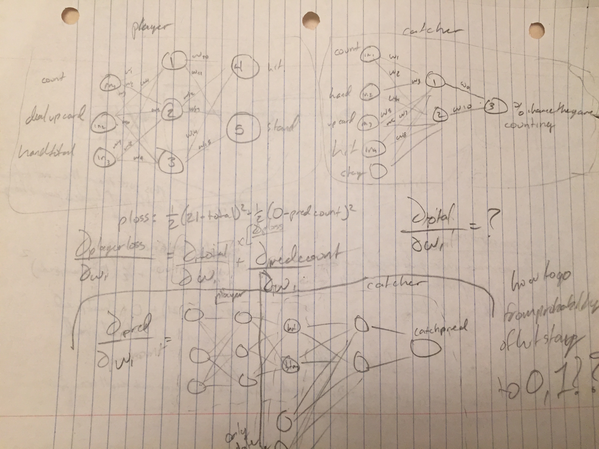

# Overview
____
This project is an experiment with Generative Adversarial Neural Networks to try and catch card counters in casinos. In this project, however, there will be many generator networks, and one discriminator network. The many generator networks will each be card counting using a [different style](#counting-styles-used). The discriminator network will learn from each of these networks how to catch card counters. The generator networks will be trained to both profit, and avoid being caught card counting, so that they don't just always lose money to avoid being caught.

## Generator Networks
____
Each generator network will stem from the following basic structure:

- Inputs
  - The count for that specific network on the table
  - The sum of the cards in the networks hand
  - The dealer's count (all a network has to do to make money is beat the dealer)
- Outputs
  - Hit or stay

Generator networks have a much harder training than the discriminator network. Generator networks must not only stay profitable, but also not be caught card counting. To accomplish this, we can do a 'two pass' training, where we first train the network to be profitable, and then afterwards we train it one more time to avoid being caught. This implies doing two rounds of backpropagation, but might be the most effective method of training. This really is just so that we have the generator networks behave appropriately for the discriminator network. The goal of this project is not to  develop a fantastic card counting network, but rather one to catch card counters. 

## Discriminator Network
____
The discriminator network will have the following inputs and outputs

- Inputs
  - The count from each card counting system present on the table
  - The move a certain network made that round (hit or stay)
  - The sum of the cards of the certain network before card was dealt
- Output
  - Probability rating of whether or not the network was card counting

The discriminator network will have a very simple loss function, which is the difference between whether or not the network was counting cards, and its prediction. 

## Control Players
____
We will also have a few control players following basic blackjack strategy that are not card counting so that the network can accurately determine what card counting does NOT look like as well. 
## Counting Styles Used
____
- Hi-Lo
- K-O
- Hi-Opt 1
- Hi-Opt 2
- Halves
- Omega 2
- Red Seven
- Zen

[Reference](https://www.blackjackapprenticeship.com/resources/card-counting-systems/)
____

# Todos
I'll be applying to schools for the next few months, so this project won't see as much time from me as it deserves. If anyone wishes to contribute, please see below.
- This project was written as a proof of concept and a research project, and was therefore written in Python in order to yield a working product as soon as possible. Convert at least the neural network training to C++ (the double backpropagation doesn't seem to be implemented in any python libraries with a C++ backend)
- Code cleaning/commenting. Code is only as good as the comments, and this project has a fair amount of undocumented, and potentially unused code. This is also written in a way that as probably not as 'pythonic' as it could be. 
- Get some computing time to actually run this project. Currently, it takes somewhere in the neighborhood of 10 minutes now to run around 500 games of poker on a Macbook Air. This rate should increase on a computer or AWS instance with some decent power. 
# Photos
I did a fair amount of reasoning for this project on paper. Below is the work done to figure out program flow, as well as how to train the neural networks. 

